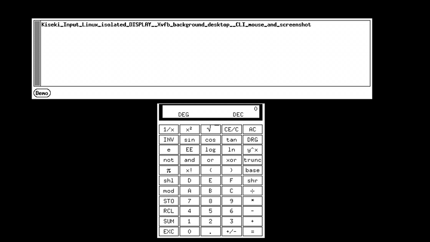
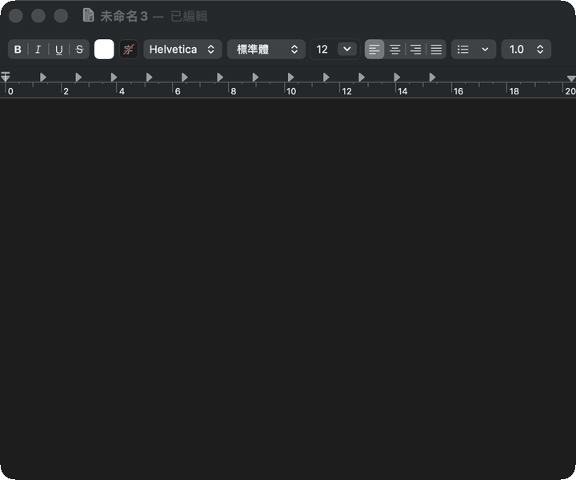

# Kiseki Input

Kiseki Input is a native C++ CLI for local desktop automation: keyboard and mouse input, system screenshots, replayable JSON macros, Agivar-style teaching recordings, burst capture, heartbeat notifications, and a configuration-first WebUI in one small tool.

It is built for developers who want a practical automation lab instead of a pile of one-off scripts. The project is CLI-first, keeps each backend slice separate, and reports platform limits explicitly instead of pretending every desktop, game, or compositor behaves the same way.

## Why Try It

- Single native CLI for input, screenshots, macros, diagnostics, and heartbeat notifications.
- Replayable JSON macros make manual UI checks repeatable.
- Teaching recordings store native input events plus keyframes so agents read compact action timelines instead of full videos.
- Burst screenshots can grab short frame sequences such as 8 frames at 60 FPS.
- Target-window and explicit background window screenshots are available for windows that accept the platform APIs.
- Linux can run an isolated Xvfb background desktop so GUI apps execute on a separate DISPLAY instead of the user's current desktop.
- Optional Cua Driver integration exposes background app launch, per-window screenshots/state, targeted clicks, text, keys, hotkeys, drags, point-path drawing, and configurable visual feedback when `cua-driver` is installed and authorized. Upstream CUA currently targets macOS and Windows, with Linux available as a pre-release backend.
- WebUI can edit configuration and inspect local teaching bundles, but it does not expose operational input/screenshot routes.
- Windows can use `IbInputSimulator.dll` when available and falls back to system input when it is not.
- Linux support uses native X11/XTest paths where the session permits it, with XDG Desktop Portal fallback for current-session screenshots on Wayland.
- macOS native code paths cover target listing, system screenshots, selected-window screenshots, and global CGEvent input in the active GUI session when the active process has the required permissions.

## See It Work

These GIFs were recorded from live CLI runs. Windows demos use the visible desktop and macro runner. Linux uses an isolated Xvfb `DISPLAY`. macOS uses the optional Cua Driver backend through `kiseki background cua`; in the controlled run, Safari stayed frontmost and the cursor position did not move.

| Macro input in Notepad | Mouse macro in Paint | Heartbeat notification |
| --- | --- | --- |
|  |  |  |

| Linux isolated DISPLAY | macOS CUA background |
| --- | --- |
|  |  |

## Try It In 60 Seconds

From the repository root after building:

```bash
kiseki doctor
kiseki modes --json
kiseki target list
kiseki screenshot desktop --output screenshot.bmp
kiseki screenshot burst --directory frames --prefix frame --frames 8 --fps 60
kiseki macro validate --file docs/assets/demos/demo-notepad-unicode.json
kiseki teach record --output teach-session --frame-interval-ms 500 --text "Open settings and save the change"
# run the same command again to stop and finalize the bundle
kiseki teach record
kiseki --config docs/assets/demos/demo-notification-config.json daemon run --once
```

If `kiseki` is not on `PATH`, use the built executable path instead, such as `build/Debug/kiseki.exe` on Windows multi-config builds.

On Windows, the demo macros can drive visible desktop apps:

```bash
kiseki macro run --file docs/assets/demos/demo-notepad-unicode.json
kiseki macro run --file docs/assets/demos/demo-paint-macro.json
```

## What Works Today

This build includes:

- C++ CLI executable: `kiseki`
- JSON configuration defaults, validation, and persistence
- Local WebUI for configuration and teaching-bundle inspection: `kiseki config-ui`
- CLI desktop screenshots and burst screenshots
- CLI target listing for window id, PID, title, and geometry
- CLI target inspection for selected windows and child receiver handles
- CLI non-visual UI observation from platform/app structure, including Windows UI Automation and macOS Accessibility/AX when available
- CLI target-window screenshots, explicit background window screenshots, and target-window burst screenshots
- CLI keyboard/mouse input
- CLI message-based background keyboard/mouse input for target windows that accept it
- CLI Linux background desktop lifecycle and input/screenshot commands when built with X11 and `Xvfb` is installed
- CLI Wayland current-session desktop screenshots through XDG Desktop Portal when `gio-2.0` and `gdk-pixbuf-2.0` are available at build time
- CLI macOS permission helpers for Screen Recording and Accessibility
- macOS native backend for config path, target listing, permission-gated desktop/window screenshots, burst screenshots, and global keyboard/mouse input
- Optional CUA Driver background operation commands through `kiseki background cua ...`, including draw-path and agent-cursor feedback helpers.
- CLI JSON macros for sequencing input, screenshots, and waits
- CLI teaching recorder: keyframes, native input event JSONL, timeline JSON, optional text/video/audio/transcript attachments, and generated `SKILL.md`
- Configurable heartbeat daemon with dismissible notifications
- Machine-readable capabilities: `kiseki capabilities`
- Human-readable diagnostics: `kiseki doctor`
- Operation and screenshot mode guide: `kiseki modes --json`

Windows input first attempts to load `IbInputSimulator.dll` next to the executable. If that DLL is absent or cannot initialize, Windows falls back to `SendInput` and reports driver input unavailable. Target-window input on Windows uses normal window messages such as `WM_CHAR`, `WM_KEYDOWN/UP`, and mouse messages when a target accepts them. Linux input uses native X11/XTest for global input and X11 events for target-window background input when available. Linux Wayland sessions use XDG Desktop Portal for current-session desktop screenshots when the portal build slice and compositor permission are available; this is screenshot support, not Wayland global input. Screenshots are system-level BMP captures: D3D11/GDI/`PrintWindow` on Windows, X11 `XGetImage` or XDG Desktop Portal on Linux, and ScreenCaptureKit on macOS. `background window screenshot` is the selected-window capture entry intended for non-activating background verification.

## Operation Modes

Run `kiseki modes` for a human guide or `kiseki modes --json` for a machine-readable guide.

| Need | Use | Background? | Verification screenshot |
| --- | --- | --- | --- |
| Current-session typing, clicking, or drawing | `kiseki input ...` | No | `kiseki screenshot desktop` or `kiseki screenshot window` |
| Current-session screenshot or burst | `kiseki screenshot desktop|burst|window|window-burst ...` | No | Same command family |
| Non-activating selected-window screenshot | `kiseki background window screenshot ...` | Yes | Same command |
| Selected-window message/API helper | `kiseki background window text|key|mouse|drag ...` | Yes, target-dependent | `kiseki background window screenshot` |
| Linux isolated DISPLAY | `kiseki background desktop ...` | Yes | `kiseki background desktop screenshot` |
| CUA target-routed app operation | `kiseki background cua ...` | Yes, provider-dependent | `kiseki background cua screenshot` or `background cua state --output` |
| Structured UI observation | `kiseki observe ui ...` | Not screenshot, not input | JSON result source |

Stable weak-model rules:

- Commands starting with `input` are current-session operations. They can use focus or the real pointer.
- Commands starting with `screenshot` are non-background/current-session capture commands, even when they select a target window.
- Commands starting with `background` are background, isolated-session, or target-routed commands.
- Verify background actions with a screenshot from the same background family. Do not use `screenshot desktop` to verify a background action.
- Use `observe ui` before screenshot-based verification when platform/app structure is enough.

## Important Boundaries

- Operational actions are CLI-only. The WebUI can read/write config and show capabilities, but it cannot trigger input, screenshots, notifications, daemon control, shell commands, or process launch.
- Target-aware and background window behavior must be checked through capabilities and platform support before relying on it.
- Game-class programs can be used for targeted screenshot experiments where the platform capture backend can access the surface. Background keyboard/mouse input depends on whether the target accepts system window messages or public automation events.
- Driver input is not a bypass mechanism. It follows the limits of the installed backend, desktop session, and target application.

## Command Map

```text
# Configure and inspect
kiseki config path|show|validate
kiseki config-ui
kiseki capabilities
kiseki doctor
kiseki modes [--json]
kiseki permissions macos screen-recording [--prompt] [--open-settings]
kiseki permissions macos accessibility [--prompt] [--open-settings]

# Discover and observe targets
kiseki target list [--target-title <text>|--target-pid <pid>|--target-window-id <id>]
kiseki target inspect [target selector]
kiseki observe ui [target selector] --provider auto|uia|ax|window-tree

# Current-session capture and input
kiseki screenshot desktop|window|burst|window-burst ...
kiseki input key|combo|text|mouse|drag ...

# Integrated background operation
kiseki background window screenshot [target selector] --output window.bmp
kiseki background window text|key|mouse|drag [target selector] ...
kiseki background desktop start|launch|screenshot|text|key|mouse|stop ...
kiseki background cua status|launch|windows|state|screenshot|click|text|key|hotkey|drag|draw ...
kiseki background cua feedback status|enable|motion|style|preset ...

# Repeatable workflows
kiseki macro validate|run --file macro.json
kiseki teach record [--output session-dir] [--duration-ms n] [--text "..."]
kiseki teach annotate --session session-dir --frame-index n|--event-index n --text "..."
kiseki teach transcribe --audio-file note.wav --output transcript.json
kiseki daemon run [--once]
```

## WebUI Contract

The embedded local WebUI exposes only:

```text
GET /api/config
PUT /api/config
GET /api/capabilities
```

It does not expose input, screenshot, notification, daemon, shell, or execution routes. Teaching bundle viewing uses local browser file selection, not a server API route.

## Macros

Macros are JSON files with a `steps` array. They are executed only by the CLI and are useful for turning a visible desktop workflow into a repeatable check.

```json
{
  "name": "paint-demo",
  "steps": [
    {"type": "combo", "keys": "win+r", "backend": "system"},
    {"type": "text", "text": "mspaint.exe"},
    {"type": "key", "key": "enter", "backend": "system"},
    {"type": "sleep", "ms": 500},
    {"type": "drag", "file": "artifacts/live-test/heart-points.txt", "backend": "system"},
    {"type": "screenshot", "output": "artifacts/live-test/paint-macro.bmp"},
    {"type": "background-screenshot", "targetTitle": "Paint", "output": "artifacts/live-test/paint-background.bmp"}
  ]
}
```

Supported macro step types: `key`, `combo`, `text`, `mouse`, `drag`, `background-mouse`, `background-drag`, `screenshot`, `background-screenshot`, and `sleep`. `input sequence --file` uses the same executor for mixed key down/up, mouse, wheel, and timed steps. Input files and action fields are validated before execution; completion, failure, and normal cancellation release inputs acquired by the sequence.

See [native input sequences and recording](docs/native-input.md) for hold/click timing, drag buttons/modifiers, timestamped paths, screenshot coordinate metadata, event-source prerequisites, and native regression probes.

Demo macro files live under `docs/assets/demos/`.

## Teaching Recordings

Teaching recordings follow the same core design as Agivar: the model-facing artifact is an action sequence plus selected keyframes, not a full video. A session directory contains:

```text
manifest.json
frames.json
actions.json
timeline.json
events.jsonl
instruction.txt
annotations.json
keyframes/frame_000000.bmp
video_keyframes/index.json
SKILL.md
media/...
```

Use `teach record` to toggle recording. The first command starts a detached recorder. Running `kiseki teach record` again writes the stop request and waits for finalization:

```bash
kiseki teach record --output artifacts/teach/save-flow --frame-interval-ms 500 --event-poll-ms 25 --title save-flow --text "Click Save after changing the setting"
kiseki teach record
```

Use `--duration-ms` only as an optional maximum duration. The default is `0`, which means record until the second `teach record` command stops it. If `--output` is omitted, the default bundle path is `artifacts/teach/teach-<UTC timestamp>`.

Windows hooks, macOS event taps, and X11 RECORD receive events independently of screenshots. The manifest identifies the event source; unavailable native sources produce an explicitly marked, incomplete polling fallback. `--event-poll-ms` controls queue draining and fallback polling. See [native recording details](docs/native-input.md#teaching-events-and-verification).

The bundle schema is optimized for agent teaching instead of raw video upload:

- `actions.json` is the compact action source of truth.
- `frames.json` indexes every captured frame.
- `manifest.json` lists selected keyframes anchored to start, key/mouse actions, and interval frames.
- `timeline.json` aligns selected keyframes and actions by timestamp.
- `events.jsonl` preserves the raw native event stream.
- `video_keyframes/index.json` is written when `--video-file` is a real video and `ffmpeg` can extract review JPEGs at selected keyframe timestamps.

Use `--video-file`, `--audio-file`, or `--transcript-file` only when real files exist. `--video-keyframe-interval-ms`, `--video-keyframe-max`, and `--no-video-keyframes` control MP4/MOV/WebM review-frame extraction. Audio is optional; when used for teaching text, run `teach transcribe` and attach the resulting transcript. If the local model directory is missing, Kiseki downloads `Systran/faster-whisper-large-v3` into `vendor/models/Systran/faster-whisper-large-v3` before transcription. The model directory can also be pre-bundled there for offline builds.

The WebUI Teaching tab reads a local teaching bundle with the browser File API. It can show keyframes as a timeline, view an optional video, play optional audio, display transcript text, and export annotations that target a specific keyframe or recorded action. It does not execute CLI commands.

## Platform Notes

Windows screenshots, target listing, target-window screenshots, system input, and message-based background input were tested in this tree. Driver-level input requires an `IbInputSimulator.dll` build artifact from `IbInputSimulator`.

Windows background screenshot uses selected-window capture through `background window screenshot`. It is the Windows native background observation path for this project; it does not require a VM, Docker, or separate session backend. Windows selected-window input remains a message/API helper for ordinary Win32 controls and apps that accept public window messages. Optional `background cua` support is separate and requires an installed Cua Driver in the interactive desktop session.

Linux support is split by session type. X11/XTest provides current-session input, target-window helpers, selected-window capture, and Xvfb isolated background desktops. Wayland current-session desktop screenshots use XDG Desktop Portal when Kiseki is built with `gio-2.0` and `gdk-pixbuf-2.0`; the compositor may still require permission or return a denial. Wayland global input is not exposed by this native backend. `kiseki target list` is the recommended first step before using target-window screenshots or background input, especially when a desktop environment exposes both a window-manager frame and a client window. Linux true background desktop support uses `Xvfb` to create an isolated X11 `DISPLAY`; commands launched there can be clicked, typed into, and captured without using the physical desktop session. Optional `background cua` support follows upstream CUA's Linux pre-release status and should be verified on a real graphical Linux session before claims.

macOS has two deliberately separate paths. Native macOS commands use Apple desktop APIs in the active GUI session: target listing uses Window Services, `observe ui --provider ax` reads the same Accessibility API surface used by Accessibility Inspector, screenshots use ScreenCaptureKit with Screen Recording permission, and global keyboard/mouse input uses Quartz CGEvent with Accessibility permission. Use `kiseki permissions macos screen-recording --prompt --open-settings` and `kiseki permissions macos accessibility --prompt --open-settings` from the same GUI Terminal/app that will run Kiseki when macOS does not show a prompt automatically. CUA background app operation is exposed through the optional Cua Driver provider under `background cua`. It requires `cua-driver`, Accessibility permission, and Screen Recording permission. For drawing, use `input drag --file` when foreground control is acceptable, and use `background cua draw` when the target-routed CUA path is required. Professional drawing apps also need normal app state prepared first: select the intended tool, set a visible foreground color, then verify with before/after screenshots. Dense drawing paths belong on `input drag`; `background cua draw` expects sparse window-local control points and rejects overly dense paths unless `--max-segments` is raised intentionally. See [docs/roadmap.md](docs/roadmap.md).

## Roadmap

See [docs/roadmap.md](docs/roadmap.md) for the Windows, Linux, and macOS platform lines.

## Build

```bash
cmake -S . -B build -DKISEKI_BUILD_TESTING=ON
cmake --build build
ctest --test-dir build --output-on-failure
```

When building with a multi-config generator, the executable is usually under `build/Debug/kiseki.exe` on Windows.

## Credits

Special thanks to [Chaoses-Ib/IbInputSimulator](https://github.com/Chaoses-Ib/IbInputSimulator). Kiseki Input's Windows driver backend is designed around `IbInputSimulator.dll` from that project.

Thank you to [trycua/cua](https://github.com/trycua/cua) for Cua Driver, which provides the optional background computer-use backend that Kiseki can call when installed.

Thanks to Codex and GPT-5.5 for implementation assistance, live Windows testing, macro verification, and demo production.
